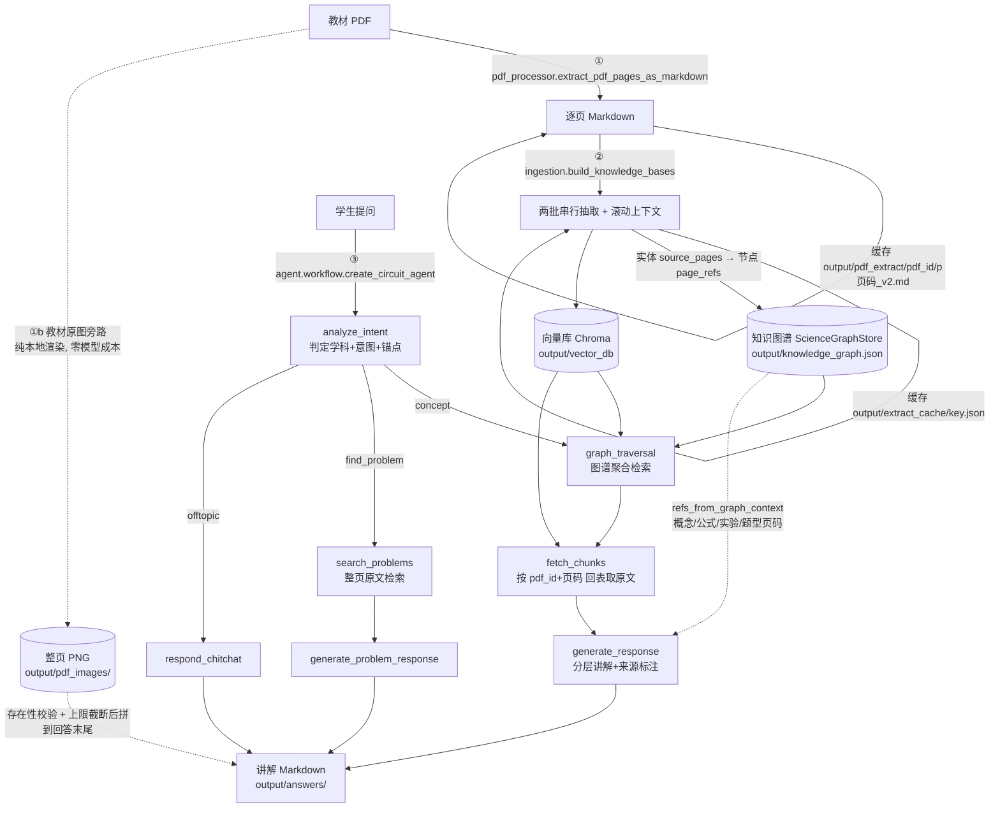

# sida-agent · 初中理科全科知识库问答 Agent

把初中**物理 / 化学 / 数学**教材 / 讲义 PDF，用视觉大模型提取、再用推理大模型结构化抽取，
沉淀为一套「知识图谱 + 向量库」双库，并对学生提问生成可溯源到教材页码的分层讲解。

---

## 1. 这个项目解决什么问题 / 核心能力

- **把纸质讲义变成能问答的知识库**：PDF 每一页先用多模态视觉模型转成结构化 Markdown
  （保留印刷文字、LaTeX 公式、表格、电路图 / 实验装置图的文字描述、手写批注），
  再由推理模型提炼成概念 / 公式 / 实验 / 题型 / 例题 / 方法等教研实体。
- **答案能指到教材第几页**：例题正文不由模型抄写，而是在抽取时记下出处页码，
  问答时按页码回向量库取讲义原文，生成的讲解里标注「（见《教材名》第 X 页）」。
- **还能直接把教材原图贴出来**：每页另按显示尺寸（长边 1600px PNG）存一张整页图，
  回答末尾由**应用层**（而非模型）确定性追加「## 【教材原图】」区块——电路图 / 几何图 /
  实验装置图不再只靠视觉模型的文字转写。页码来源有两条：**搜题链路**取命中讲义页切片，
  **讲解链路**（概念 / 公式 / 实验 / 题型 / 方法）取抽取时记录在节点 `page_refs` 上的页码
  （见 **「6.13 教材原图旁路」**）。
- **问公式名 / 集合名词也能命中**：提问的锚点未必是概念名——可能是公式名
  （「三角函数的倍角公式」）、也可能是一族实体的统称（「两角和公式」= 正弦/余弦/正切
  三条）。检索链路对锚点做「精确 → 模糊 → 同族展开」三级解析，把整族内容一次捞回，
  避免「知识在库里却答未收录」（见 6.8）；带度数标记的提问（「15°、22.5°三角函数值」）
  与挂在兄弟概念名下的公式（「18°三角函数」）由度数族匹配与概念级下钻兜住（见 6.9）。
- <span style="color:red">**三科共享一套双库、可反复累积**：同一份图谱 + 向量库可被物理 / 化学 / 数学、
  多本不同 PDF 多次灌入；同名概念按「越建越全」合并，不同书的同页码 / 同题号靠
  `pdf_id` 前缀隔离，互不覆盖。</span>
- **整本书也能喂**：页码区间可开到几百页，内部按字符预算自动切子块、逐块抽取即落盘，
  配合缓存天然支持断点续跑，不必一次成功。
- **花钱前先亮规模**：建库前做一次只读「规模预估」（不调模型），统计要新增多少次视觉 /
  推理调用，交互确认或用 `--yes` 放行；结束打印两路真实 token 消耗。
- **三种用法**：单轮问答（`ask`）、一次性讲解（`all`）、可续聊的多轮对话（`chat`，
  会话落盘、超预算自动压缩进摘要、能按题目原文「找题」）。

---

## 2. 整体架构

数据从输入到输出经过「视觉提取 → 结构化抽取入库 → 检索问答」三个阶段，
入口都是 `main.py`，由 `--stage` 决定走哪几段。



- **阶段①（视觉）**：`pdf_processor.py`，PDF 页 → Markdown，逐页缓存。
  同一步里另跑一条**教材原图旁路**（`storage/image_store.py`），把每页存成整页 PNG
  供回答展示；它不参与缓存判定、不写页 Markdown，与版本号完全解耦（见 6.13）。
- **阶段②（抽取入库）**：`ingestion.py`，Markdown → 双库，按子块增量、抽取结果缓存；
  同时把每个实体出现的页码（`source_pages` → 节点 `page_refs`）一并入图，供问答末端配图。
- **阶段③（问答）**：`agent/workflow.py`（LangGraph），提问 → 检索 → 生成分层讲解。
  `--stage chat` 时额外经 `chat_session.py` 挂 SqliteSaver 做会话持久化。

---

## 3. 快速开始

### 3.1 安装

项目用 [uv](https://docs.astral.sh/uv/) 管理（依赖见 `pyproject.toml` / `uv.lock`，要求 Python ≥ 3.11）。

```powershell
cd sida-agent
uv sync
```

Embedding 走本地 Ollama，首次需拉取模型（模型名以 `.env` 里 `EMBEDDING_MODEL` 为准）：

```powershell
ollama pull qwen3-embedding:latest
```

并确保 Ollama 服务已启动（`EMBEDDING_BASE_URL` 指向它，如 `http://localhost:11434`）。

### 3.2 配置 `.env`

在 `sida-agent/` 下创建 `.env`（仓库里已有 `.gitignore` 忽略它，**本仓库未提供 `.env.example`**）。
所有值均无内置默认，缺项会在启动时报「配置不完整」并列出缺哪几项：

```ini
# 角色一：视觉解析（PDF 页 -> Markdown），填任意 OpenAI 兼容视觉端点
VISION_BASE_URL=http://your-vision-host/v1
VISION_MODEL=your-vision-model
VISION_API_KEY=sk-xxxx

# 角色二：推理（知识抽取 + 问答），填任意 OpenAI 兼容端点
REASONING_BASE_URL=http://your-reasoning-host/v1
REASONING_MODEL=your-reasoning-model
REASONING_API_KEY=sk-xxxx

# Embedding（向量库，本地 Ollama）
EMBEDDING_BASE_URL=http://localhost:11434
EMBEDDING_MODEL=qwen3-embedding:latest
```

> `config.py` 用 `load_dotenv` 读取，**同名系统环境变量优先于 `.env`**。Ollama 直连时
> `trust_env=False`，避免被 Windows 系统代理劫持（否则可能 502）。

### 3.3 最小可跑命令

先建库（把某本 PDF 的第 11–12 页灌入物理库），再单轮问答：

```powershell
# 建库：视觉提取 + 结构化抽取，累积进双库
uv run python main.py --stage build --pdf "L:/vivi/初三/物理/9S合并PDF-完整.pdf" --start-page 11 --end-page 12 --subject physics

# 问答：复用已持久化的双库
uv run python main.py --stage ask --query "讲解可变电路的分析思路"
```

多轮对话 REPL（会话落盘 `output/chat/`，`Ctrl+C` 退出）：

```powershell
uv run python main.py --stage chat                 # 新建会话
uv run python main.py --stage chat --list           # 只列既有会话
uv run python main.py --stage chat --session s-xxxx # 续聊指定会话
```

> `--pdf` 默认值 `L:/vivi/初三/物理/9S合并PDF-完整.pdf` 是开发机路径，换机器请显式传入自己的 PDF。

**给已建库的教材补「教材原图」**（图片旁路是后加的，旧库没有图）：

```powershell
# --max-new-calls 0 --max-chunks 0 双重保证零模型调用：
#   视觉侧页缓存命中 + 抽取侧不处理任何新子块，只跑纯本地渲染补图
uv run python main.py --stage build --pdf "L:/vivi/初三/物理/9S合并PDF-完整.pdf" --start-page 5 --end-page 186 --subject physics --max-new-calls 0 --max-chunks 0 --yes
```

日志出现 `教材原图：本次新落盘 N 张` 即完成；重复执行会打印 `本次新落盘 0 张`（存在即跳过）。
图片落在 `output/pdf_images/{pdf_id}/`，回答里的附图路径由落盘时按目标目录自动换算。

> 这两个 `0` 都是必需的：仅 `--max-new-calls 0` 只挡住视觉模型，抽取侧在 v4 缓存未建立时
> 仍会调用推理模型（**注意这条在 v4 之前是不同的**——当时抽取缓存命中，单靠它即可零调用）。

**重建抽取层，让「讲解类提问」也能配图**（`_EXTRACT_SCHEMA_VERSION` v3 → v4）：

```powershell
# 放开 --max-chunks，按子块重抽（每子块 2 次推理调用）；视觉页缓存不受影响
uv run python main.py --stage build --pdf "L:/vivi/初三/物理/9S合并PDF-完整.pdf" --start-page 5 --end-page 186 --subject physics --max-new-calls 0 --yes
```

- **为什么必须重抽**：旧缓存里没有 `source_pages` 字段，节点也就没有 `page_refs`，
  概念 / 公式 / 实验 / 题型 / 方法路径一律配不上图。
- **代价可控**：只失效 `output/extract_cache/`（推理 LLM 重抽），
  `output/pdf_extract/` 的逐页视觉缓存照旧命中（实测命令输出
  `视觉提取：无实际模型调用（全部命中缓存）`）。
- **可分批**：`--max-chunks N` 限本轮处理 N 个新子块，重跑同命令续跑；
  未重建完的区间只是「该部分实体暂不配图」，不影响已重建部分。
- **验证**：`uv run python -c "from storage.graph_store import ScienceGraphStore as S; g=S.load(); print(sum(1 for _,d in g.graph.nodes(data=True) if d.get('page_refs')))"`
  输出带 `page_refs` 的节点数（0 表示还没重建）。

### 3.4 HTTP API 服务（`--stage serve`）

把 CLI 的 `build` / `ask` / `chat` / 教材清单能力暴露为 HTTP 接口，供外部系统对接；
问答与建库进度均支持 **SSE 流式**。启动：

```powershell
uv run python main.py --stage serve --host 127.0.0.1 --port 6173
# 打开交互式文档 http://127.0.0.1:6173/docs （OpenAPI / Swagger）
```

启动时 `lifespan` 一次性加载双库（图谱 + 向量）与线程池、build 执行器；所有业务代码为同步
（Chroma / NetworkX / SqliteSaver / LLM），统一经线程池执行，不阻塞事件循环。**无鉴权**，
默认仅本机监听，跨机暴露请自行置于反向代理之后。

| 方法 | 路径 | 说明 |
|---|---|---|
| GET | `/health` | 存活检查：`{status, graph_nodes, vector_count}` |
| GET | `/books` | 已入库教材清单（`pdf_id` + 名称） |
| GET | `/pdf_images/{pdf_id}/p{页}.png` | **教材原图静态资源**：外部系统据此显示回答附图（见下） |
| POST | `/ask` | 单轮问答，JSON 返回（含 `answer_path`，同时落盘 `output/answers/`） |
| POST | `/ask/stream` | **SSE** 流式问答：逐 `token` 帧 → `result` 帧 → `event: end` |
| GET | `/chat/sessions` | 会话列表（与 CLI **共用** `checkpoints.sqlite`） |
| POST | `/chat/sessions` | 新建会话（可选传 `session_id`） |
| GET | `/chat/sessions/{id}` | 读取某会话历史（`messages` + 摘要） |
| POST | `/chat/sessions/{id}/messages` | 发一轮消息：`stream=true`（默认）走 SSE，否则 JSON |
| POST | `/chat/sessions/{id}/export` | 导出会话 Markdown（`?download=true` 直接下载文件） |
| POST | `/build/estimate` | 只读规模预估（不调模型），返回新增视觉 / 推理调用数 |
| POST | `/build` | 提交异步建库任务，返回 `task_id`；已有任务在跑则 **409** |
| GET | `/build/tasks` | 任务列表 |
| GET | `/build/tasks/{id}` | 单任务状态快照 |
| GET | `/build/tasks/{id}/events?since=N` | **SSE** 建库进度：`progress` 帧 → 终态 `task_status` 帧 |

SSE 帧格式：每帧 `data: <json>\n\n`，流结束追加 `event: end\ndata: {}\n\n`。
`/build` 的工作流：先 `POST /build/estimate` 看规模 → `POST /build`（`confirm:true` 放行）
拿 `task_id` → 轮询 `GET /build/tasks/{id}` 或订阅 `/events`。build 任务注册表为**内存态**，
服务重启后历史丢失，但重新提交同一区间会从磁盘缓存续跑（已缓存页 / 子块不再计费，写库幂等）。

> **回答里的「教材原图」如何在外部显示**：服务把 `output/pdf_images` 目录挂载为
> `/pdf_images/*` 静态资源，并在 `/ask`、`/ask/stream`、`/chat/.../messages` 的 `result`
> 事件里把图片链接重写为 HTTP 绝对 URL（`{base}/pdf_images/{pdf_id}/p{页}.png`），
> 外部浏览器 / Markdown 渲染器据此直接显示原图。`{base}` 默认按请求 host 推导；
> 反向代理 / 自定义域名场景下在 `.env` 设 `API_PUBLIC_BASE_URL` 固定对外地址。
> 落盘到 `output/answers/`、`output/chat/exports/` 的 Markdown 副本不受影响，
> 仍是相对本地路径（供本地阅读器打开）。SSE 的 `token` 帧不含图片区块，
> 流式客户端在收到 `result` 帧时用完整内容替换即可看到图。

#### curl 客户端用例（PowerShell）

> PowerShell 里 `curl` 默认是 `Invoke-WebRequest` 的别名，必须写 **`curl.exe`** 才是真 curl；
> 单引号参数内的 JSON 双引号要写成 `\"`（PS 5.1 传参给原生程序时会剥掉裸引号）。
> 若中文请求体出现乱码，先执行 `[Console]::OutputEncoding = [Text.Encoding]::UTF8`。

```powershell
$base = "http://127.0.0.1:6173"

# ---- 基础 ----
# 存活检查
curl.exe -sS "$base/health"
# 已入库教材清单
curl.exe -sS "$base/books"

# ---- 单轮问答 ----
# JSON 一次性返回（subject 可省略，由 Agent 自动判定；save=false 则不落盘 md）
curl.exe -sS -X POST "$base/ask" `
  -H "Content-Type: application/json" `
  -d '{\"query\":\"讲解欧姆定律\",\"subject\":\"physics\",\"save\":true}'
# SSE 流式问答：-N 关闭缓冲，逐 token 帧实时打印
curl.exe -N -sS -X POST "$base/ask/stream" `
  -H "Content-Type: application/json" `
  -d '{\"query\":\"讲解欧姆定律\"}'

# ---- 多轮会话（与 CLI chat 共用 checkpoints.sqlite）----
# 会话列表 / 新建会话（可自定 id）
curl.exe -sS "$base/chat/sessions"
curl.exe -sS -X POST "$base/chat/sessions" `
  -H "Content-Type: application/json" `
  -d '{\"session_id\":\"s-demo01\"}'
# 读取某会话历史（messages + 摘要）
curl.exe -sS "$base/chat/sessions/s-demo01"
# 发一轮提问：默认 SSE 流式
curl.exe -N -sS -X POST "$base/chat/sessions/s-demo01/messages" `
  -H "Content-Type: application/json" `
  -d '{\"message\":\"讲解欧姆定律\"}'
# 非流式：等完整结果返回 JSON
curl.exe -sS -X POST "$base/chat/sessions/s-demo01/messages" `
  -H "Content-Type: application/json" `
  -d '{\"message\":\"那它的适用范围呢\",\"stream\":false}'
# 导出会话 Markdown（加 ?download=true 直接下载文件内容）
curl.exe -sS -X POST "$base/chat/sessions/s-demo01/export"
curl.exe -sS -X POST "$base/chat/sessions/s-demo01/export?download=true" -o session.md

# ---- 建库（异步任务）----
# 只读规模预估（0 模型调用），先看要烧多少次调用
curl.exe -sS -X POST "$base/build/estimate" `
  -H "Content-Type: application/json" `
  -d '{\"pdf\":\"L:/vivi/初三/物理/9S合并PDF-完整.pdf\",\"startPage\":11,\"endPage\":12,\"subject\":\"physics\"}'
# 提交建库任务：confirm=true 放行新调用；成功返回 task_id（有任务在跑则 409）
curl.exe -sS -X POST "$base/build" `
  -H "Content-Type: application/json" `
  -d '{\"pdf\":\"L:/vivi/初三/物理/9S合并PDF-完整.pdf\",\"startPage\":11,\"endPage\":12,\"subject\":\"physics\",\"confirm\":true}'
# 任务列表 / 单任务状态 / SSE 进度流（since 为事件游标，断线后接着续传）
curl.exe -sS "$base/build/tasks"
curl.exe -sS "$base/build/tasks/<task_id>"
curl.exe -N -sS "$base/build/tasks/<task_id>/events?since=0"
```

---

## 4. 命令行参数表

逐条对应 `main.py` 的 `parse_args()`（`ArgumentDefaultsHelpFormatter`，帮助里会显示默认值）。

| 参数 | 类型 / 取值 | 默认值 | 作用 |
|---|---|---|---|
| `--stage` | `all` / `build` / `ask` / `chat` / `serve` | `all` | `all`=提取+建库+问答；`build`=仅提取并累加进双库；`ask`=仅复用已持久化双库问答；`chat`=多轮对话 REPL；`serve`=启动 FastAPI HTTP 服务（见 3.4） |
| `--pdf` | str | `L:/vivi/初三/物理/9S合并PDF-完整.pdf` | 教材 PDF 路径（build/all 使用） |
| `--book` | str（metavar 教材名） | `None` | 该 PDF 的教材显示名，用于答案「收录于《教材名》」来源标注；缺省取 PDF 文件名去扩展名；重复登记同一 `--pdf` 即改名覆盖 |
| `--start-page` | int | `11` | 起始页码（从 1 计） |
| `--end-page` | int | `12` | 结束页码（含），超出总页数自动截断 |
| `--subject` | `physics` / `chemistry` / `math` | `physics` | 学科；接受中文 / 拼音别名，`_subject_choice` 经 `normalize_subject` 归一化，非法值报命令行错误 |
| `--query` | str | `请帮我系统讲解可变电路的分析思路，并用具体的典型例题带我推导一遍` | 学生提问（ask/all 使用） |
| `--session` | str（metavar ID） | `None` | chat：进入 / 续聊指定会话（`thread_id`，见 `--list`）；缺省新建会话 |
| `--list` | flag（`dest=chat_list`） | `False` | 列出既有会话清单后退出（不进入对话） |
| `--export` | str（`dest=chat_export`，metavar ID） | `None` | 把指定会话导出为 Markdown 后退出（不进入对话） |
| `--max-chars` | int | `6000` | 知识抽取单子块字符预算（build/all）：超过即自动切块增量抽取 |
| `--max-chunks` | int（metavar N） | `None` | 本次建库最多处理 N 个未命中缓存的新子块（缓存命中不占额度），达上限即停、重跑续跑 |
| `--max-new-calls` | int（metavar N） | `None` | 本次视觉提取最多新调用 N 次（已缓存页不占额度），达上限即停、重跑续跑（控视觉模型成本） |
| `--yes` | flag | `False` | 跳过建库前的规模预估确认（脚本 / 夜间批量自动放行） |
| `--host` | str | `127.0.0.1` | serve：HTTP 监听地址 |
| `--port` | int | `6173` | serve：HTTP 监听端口 |
| `--reload` | flag | `False` | serve：代码热重载（开发用，uvicorn reload） |

> `--list` / `--export` 在 `main()` 里**先于 `--stage` 分发**处理，命中即执行并退出。
> 不带任何参数运行 = 全部默认值（等价旧版硬编码流水线，便于快速回归）。

---

## 5. 目录结构与关键文件职责

```
sida-agent/
├── main.py                    # CLI 入口：argparse、stage 分发、规模预估/确认、TokenMeter、chat REPL、答案落盘
├── config.py                  # LLM 配置：.env 读取、get_llm/get_vision_llm/get_reasoning_llm/get_embedding_model
├── logger.py                  # 日志：控制台(INFO+) + 文件 output/sida_agent.log(DEBUG+) 双通道
├── pdf_processor.py           # 阶段①：PDF 页 → Markdown（视觉提取、逐页缓存、重试/超时、_fix_math、_pdf_id）
├── ingestion.py               # 阶段②：分块 + 两批抽取 + 滚动上下文 + 合并写库 + 审计 + 双库落盘（核心）
├── chat_session.py            # chat 会话后端：SqliteSaver、会话清单/快照/导出 Markdown
├── migrate_book_sources.py    # 一次性迁移脚本：为既有图谱回填 sources + 注册 PdfSource（零 LLM，硬编码历史 pdf_id）
├── agent/
│   ├── state.py               # LangGraph 状态定义（CircuitAgentState）
│   └── workflow.py            # 阶段③：问答工作流（意图判定/图谱检索/回表/生成/搜题/闲聊/上下文压缩）
├── storage/
│   ├── graph_store.py         # ScienceGraphStore：node_key 规则、增删边、get_subgraph/get_entity_subgraph/章节聚合、实体+同族模糊解析、度数族匹配、概念级下钻+相关性截断、合并、save/load
│   ├── vector_store.py        # get_vector_store：Chroma 持久化封装
│   └── image_store.py         # 教材原图旁路：落盘/去重、引用归一化、图区渲染、路径重写（页缓存与抽取缓存全程不感知，见 6.13）
├── api/                       # 阶段④：FastAPI HTTP 服务层（`--stage serve`，见 3.4）
│   ├── app.py                 # create_app：lifespan 建 Runtime（双库+线程池+BuildRegistry）、CORS、挂载路由、/health
│   ├── deps.py                # Runtime 单例、run_blocking（线程池跑同步业务）、SSE 生产者桥接（同步生成器→asyncio.Queue）
│   ├── tasks.py               # BuildTask（事件环形缓冲+快照）与 BuildRegistry（单后台线程串行执行 build，避免双库并发写）
│   ├── schemas.py             # Pydantic 请求/响应模型（Subject 限定三科、Estimate/Build/Chat/Ask 等）
│   ├── runner.py              # 复用 main 的落盘/归一化 + workflow，把 ask/chat 包装成同步事件生成器（token 流）
│   └── routers/               # books（GET /books）、ask（POST /ask、/ask/stream）、chat（会话 CRUD + 消息 SSE）、build（estimate / 提交 / 任务状态 / 事件 SSE）
├── pyproject.toml             # 依赖与 Python 版本声明
├── uv.lock                    # 锁定依赖版本
├── .env                       # 模型服务配置（被 .gitignore 忽略，不入库）
├── .python-version            # uv 使用的 Python 版本（3.11）
└── output/                    # 运行产物（被 .gitignore 忽略）
    ├── pdf_extract/{pdf_id}/p{页码}_v2.md   # 视觉逐页缓存
    ├── pdf_images/{pdf_id}/p{页码:04d}.png  # 教材原图（长边 1600px，回答末尾展示用）
    ├── extract_cache/{key}.json             # 抽取结果缓存
    ├── vector_db/                           # Chroma 持久化向量库
    ├── knowledge_graph.json                 # 图谱 JSON 快照
    ├── answers/answer_{时间}_{学科}.md       # 单轮问答讲解（图片路径已按本目录改写）
    ├── chat/checkpoints.sqlite              # chat 会话检查点
    ├── chat/exports/                        # chat 会话导出
    └── sida_agent.log                       # 全量 DEBUG 日志
```

### 关键第三方依赖（`pyproject.toml`，Python ≥ 3.11）

| 依赖 | 用途 |
|---|---|
| `pymupdf` | PDF 页面渲染成 PNG 供视觉模型 |
| `langchain-openai` | 经 OpenAI 兼容端点调用视觉 / 推理模型（`ChatOpenAI`） |
| `langchain-ollama` | 本地 Ollama 嵌入模型（`OllamaEmbeddings`） |
| `langchain-chroma` / `chromadb` | 向量库持久化与检索 |
| `langgraph` / `langgraph-checkpoint-sqlite` | 问答工作流状态机 + chat 会话检查点 |
| `networkx` | 知识图谱（`DiGraph` + node_link JSON 读写） |
| `langchain-core` / `openai` / `pydantic` | 消息 / 客户端 / 配置类型 |
| `python-dotenv` | 读取 `.env` |
| `fastapi` / `uvicorn[standard]` | HTTP API 服务层（见 3.4），SSE 用 FastAPI 内置 `StreamingResponse` |

---

## 6. 关键技术方案

### 6.1 视觉提取与逐页缓存（`pdf_processor.py`）

- `extract_pdf_pages_as_markdown(pdf_path, start_page, end_page, ...)`：用 PyMuPDF
  把每页渲染成 PNG（长边上限 `MAX_LONG_EDGE=3000`、放大倍数上限 `MAX_ZOOM=4.0`），
  连同一段通用结构化提示词 `PROMPT` 交给视觉模型。这份 PNG **仅供模型这一次调用，不回写页
  Markdown**——回答末尾要展示给用户的「教材原图」另有一条独立旁路，按显示尺寸单独落盘
  （见 **「6.13 教材原图旁路」**）。
- **缓存命名**：`output/pdf_extract/{pdf_id}/p{页码:04d}_{_EXTRACT_VERSION}.md`，
  当前 `_EXTRACT_VERSION="v2"`。`pdf_id = _pdf_id(pdf)` 是 **PDF 文件内容 SHA-256 的前 16 位**
  （与 `knowledge_extract/extract_pdf` 同算法，两项目可共用缓存目录）。
- **判定「已提取」**：`extract_pdf_pages_as_markdown` 循环里，页缓存文件存在且
  `read_text().strip()` 非空即直接读缓存、不再调模型。因此**中断重跑自动跳过已完成页**。
  版本号 `v2` 变更（`PROMPT` / 渲染参数 / 后处理调整）会让旧缓存整体失效。
- **后处理**：`_fix_math` 把模型偶发的成对 `$$ ... $$`（跨行）折叠成单行行内 `$...$`，
  避免块级公式在部分渲染器里失效。
- **重试 / 超时 / 失败处理**：`_invoke_llm` 外层重试 `LLM_RETRIES=2`（最多 3 次尝试），
  失败按 `wait = 2*(attempt+1)` 秒退避（2s、4s）；底层 `ChatOpenAI` 用 `max_retries=0`
  避免双份重试；单次请求 `LLM_TIMEOUT=300s`、`MAX_TOKENS=8192`。三次仍失败抛
  `RuntimeError`。模型返回空内容时**不写缓存**并记 warning（该页下次会重抽）。

### 6.2 长文档自动分块（`ingestion._split_into_chunks`）

- 页面是**原子单位**（每页需以 `subject:Page:{pdf_id}:{页码}` 独立入向量库供例题回表），
  因此**只在页与页之间切**，不跨页拆内容。切分条件：
  - 累加后 `cur_len + len(content) > max_chars`（默认 `6000`，即 `--max-chars`）；或
  - 已攒到预算的 `_CHUNK_HEADING_FACTOR=0.6`（即 3600 字）且**下一页是 Markdown 标题行**
    （正则 `^#{1,3}\s`）时提前切一刀，避免把新章节标题留在块尾。
  - 单页内容超预算时强制单独成块。

### 6.3 两批串行抽取 + 滚动上下文（`ingestion._extract_chunk_data`）

- 每个子块做**两批** LLM 抽取：`_build_knowledge_prompt`（章节 / 概念 / 公式 / 实验 / 方法）
  → `_build_question_prompt`（题型 / 例题 / 补充关系，并注入第一批的概念名保证引用一致）。
- 概念 / 公式 / 实验 / 题型 / 方法都要输出 **`source_pages`**（该实体在本文本中出现的页码，
  即正文 `--- 第 N 页 ---` 标记里的 N），提示词明确要求「只填本文本里真实出现过的页码，
  不要推算」。这是**教材原图旁路**在讲解类提问下的页码来源（见 6.13）。
- 推理模型经 `get_reasoning_llm(enable_thinking=False)` 创建（追求吞吐，关思考模式）。
- **滚动上下文**（`_gather_known_context`）：处理子块前注入两块信息，让模型「记得」此前建过什么，
  解决跨子块命名不一致 / 章节重复开章：
  - 章节：从图谱取该学科所有 `Chapter` 节点标题（上限 `_KNOWN_CONTEXT_CHAPTERS_CAP=120`）；
  - 相关概念：用当前子块**前 2000 字符**去向量库做相似度检索（限定 `subject`+`Concept`），
    取 top `_KNOWN_CONTEXT_TOP_K=12` 条「名称：描述前 40 字」。
  - 注入块（`_build_context_block`）明确要求：命中已有概念 / 章节时 `name`/`title` **逐字复用**，
    不得另起同义名。检索失败时捕获异常、忽略并继续（不阻断抽取）。

### 6.4 抽取缓存与断点续跑（`ingestion`）

- **缓存 key**：`_cache_key(subject, full_markdown)` =
  `sha256(f"{subject}|{_EXTRACT_SCHEMA_VERSION}|{full_markdown}")[:16]`，当前
  `_EXTRACT_SCHEMA_VERSION="v4"`。缓存文件 `output/extract_cache/{key}.json`。
  - **v4（当前）**：知识实体新增 `source_pages` 字段 → 落在节点 `page_refs` 上，供回答末尾
    旁路拼「教材原图」——此前只有「回表到具体讲义页」的例题路径配得上图，概念/公式/实验
    路径无页码依据。
  - 代价：**抽取层缓存整体失效**（`output/extract_cache/` 需重建，推理 LLM 按子块重抽）。
    但**视觉页缓存 `output/pdf_extract/` 不受影响**（那是 `pdf_processor._EXTRACT_VERSION`
    的语义），这正是把图片旁路做在前面、与抽取 schema 解耦的价值。
- key **只由该子块自身内容决定**，所以重跑同一条命令时已处理子块直接命中缓存、0 次 LLM 调用。
  `_persist_chunk` 每处理完一个子块就 `graph_db.save()` 一次——中途崩溃只丢当前子块，
  已处理子块均已持久化 + 缓存，配合上条即**天然断点续跑**。
- JSON 解析健壮性（`_extract_json`）：解析失败时追加 `_JSON_RETRY_HINT` 重试一次
  （`max_attempts=2`）；若是字符串里夹带未转义反斜杠（模型把 LaTeX 记法原样抄入），
  先经 `_repair_json_escapes` 就地修复再解析；两次都失败才抛 `RuntimeError`。
- 字段类型归一化（`_normalize_extracted`）：写库 / 建向量前统一执行一次（**缓存命中的旧脏数据也覆盖**），
  把「应为数组却是字符串」的字段告警置空（杜绝 `list("中文")` 拆成单字符），
  `symbols` 仅保留 dict 元素，例题 `source` 非 dict 置 `{}`。

### 6.5 跨块 / 跨来源合并策略（`ingestion._ensure_entity`）

实体节点键 = `node_key(subject, kind, name)` = `f"{subject}:{Kind}:{name}"`（学科命名空间隔离，
避免物理「分子」与化学「分子」互相覆盖）。同名实体第二次写入按「**越建越全**」逐属性合并
（不再是先到先得的 `setdefault`）：

| 字段类别 | 合并规则 | 判断依据 |
|---|---|---|
| 旧值缺失 / 为空（`None`/`""`/`[]`/`{}`） | 补上新值 | 修掉空壳节点永不更新 |
| 本次传入为空值 | 保留旧值不动 | 空抽取不冲刷已收录内容 |
| 无序列表（`breakdown`/`common_mistakes`/`sources`/`related_concepts`/`page_refs`…） | union 去重保序 | 要点集合可累加；`page_refs` 靠此跨子块累积页码 |
| **顺序敏感字段**（`_SEQUENCE_FIELDS` = `derivation`/`template`/`steps`） | 保留更长的一份 | 两套步骤 union 会串成乱序流程 |
| 标量字符串 | 保留更长的一份 | 更详细的表述优先 |
| dict 字段（例题 `source`） | 只补缺失 / 为空的键，已有键先到先得、不覆盖 | 锁定首次抽取的真实 `page`，防「新标题配旧页码」缝合怪 |

**跨 PDF 来源隔离**：`main.py` 把 `pdf_id`（内容哈希前 16 位）传入 `build_knowledge_bases`，
用于两类无来源维度的键：
- 讲义页切片键 → `subject:Page:{pdf_id}:{页码}`（`_build_page_docs`）；
- 例题节点键 → `{pdf_id}:{loc}:{题号}`（`_write_graph`），`loc` 取 `source.page`，缺页时退化为
  `na-{pdf_id}-{序号}`。题号降级为展示属性 `number`，不再充当唯一标识
  （教辅每章从「例1」重编，同书跨章也会撞号，故必须带页定位）。

概念 / 公式 / 实验 / 题型 / 方法等知识实体**同名即同一知识点，不做来源隔离**，
靠上表合并累积；`sources` 属性累积 `pdf_id` 列表，作为「多本教材共收 = 核心考点」信号，
问答时反查 `PdfSource` 注册表把「图谱收录」升级为「收录于《教材名》」。

**`page_refs` 为什么是 `["{pdf_id}:{页码}", ...]` 而不是 `{pdf_id: [页码]}`**：
同名实体跨子块出现时若用 dict，合并只补旧值里缺失的键、**不并集内层列表**，后一子块的页码
会被整段丢弃；用扁平列表才走 union 分支、逐块累积。同理它也**不在** `_SEQUENCE_FIELDS` 里
（那里「保留更长者」同样会丢掉先前的页码）。落库形态由 `_write_graph._page_refs_of` 生成，
并用**本子块真实页码集合**过滤越界值（防模型把公式系数/年份当页码）。

### 6.6 审计 / 异常检测（`ingestion._audit_graph`）

整轮建库结束后（`graph_db.save()` 前）审计本学科：
- 列出**空壳概念节点**（无 `description`，多为 `prerequisites` 前置引用或历史脏数据），报告前 20 个；
- 用 `difflib.SequenceMatcher` 两两比较**有描述**的概念名，相似度 ≥ `_DUP_CONCEPT_RATIO=0.82`
  的报为**疑似重复概念对**（前 10 对）。审计**只报告不动库**，用户核对后可显式
  `graph_db.merge_concepts(subject, canonical, alias)` 合并。
- 防幽灵节点：`_write_graph` 里 `extra_relations` / `related_concepts`（经 `_link_concept_refs`）/
  例题 `question_type` 引用不存在的概念时**告警跳过、不盲建空壳**（例外：`prerequisites`
  仍用 `_ensure_entity` 建占位 Concept，作为跨 PDF 分次累积的合理前向声明）。
- **防孤儿节点（`_resolve_ref_key` 跨种类解析）**：`related_concepts` 名义上填「概念名」，
  但 LLM 实测常填**兄弟实体名**（如「二倍角公式」→「两角和的正弦公式」）。早期只认
  `Concept`，这类引用被整体丢弃，公式节点随即成为无任何边的**孤儿**——图谱里看得见、
  检索链路永远走不到（`get_subgraph` 只从概念节点出发）。现按 `_REF_KINDS`
  （Concept → Formula → Experiment → QuestionType → Method → Example）**逐个精确查找**，
  Concept 优先；命中非 Concept 时改用补充关系 `REL_EXTRA` 连边，保住连通性。
  仍然只做精确匹配、不新建节点（防幽灵与防孤儿两个目标同时成立）。
- **同块共现兜底**：某实体一个概念邻居都没有时（引用全是兄弟实体、或整段为空），
  按「同块共现」挂到**本块声明的**概念上（`REL_EXTRA`），保证每个实体都能从概念出发被
  检索到。日志：`[ingestion] 二倍角公式 无概念邻居，按同块共现挂到 2 个概念: …`。
  这两项是 6.8 实体锚点检索的**数据前提**：即便仍有历史遗留孤儿，`get_entity_subgraph`
  也能直接从实体入口命中，不再依赖它是否挂上了概念。

### 6.7 检索与问答链路（`agent/workflow.py`）

LangGraph 状态机（`create_circuit_agent` 编译），节点：
`manage_context → analyze_intent → {graph_traversal → fetch_chunks → generate_response
| search_problems → generate_problem_response | respond_chitchat} → END`。
分流由 `route_by_intent` 按意图决定。

- **`analyze_intent`**：一次低温短输出 LLM 调用（`temperature=0.0`、`max_tokens=128`、关思考），
  判定 `{subject, intent, concept, search_text}`；`intent` 三选一 `concept`/`find_problem`/`offtopic`。
  解析用 `_parse_intent`（非标准 JSON 时退回正则提取字段；任何回退到 `physics` 都记 warning）。
- **`graph_traversal`（concept 链路）四级兜底**：
  1. 概念名直接命中 → `get_subgraph` 做 1~2 跳聚合（`_resolve_concept` 内部还有一次
     去教学尾缀 → 双向包含 → `difflib≥0.6` 的模糊解析；并从兄弟概念下钻一层挂载实体、
     各桶按锚点相关性排序后截断，见 6.9）；
  2. 返回的 `concept` 为 `None`（图谱里根本没有这个概念节点）→ 把锚点当**非概念实体名**
     解析：`get_entity_subgraph` 以公式 / 题型 / 方法 / 例题名为入口聚合（见 **「6.8 实体锚点
     解析与集合名词同族展开」**）。这一级必须排在旧的 `get_by_name` 之前——`get_by_name`
     要求实体已挂到概念上，历史建库遗留的**孤儿公式节点**恰恰挂不上，会直接漏掉；
  3. 实体名仍未命中 → 按 题型 → 方法 → 例题 的优先级 `get_by_name` 反查其相邻 Concept，
     改用该概念重新聚合；
  4. 命中的是**空壳概念**（无 description/breakdown 且聚合不到题型 / 例题）→
     阶段一按提问原文在 1 跳邻居概念里挑字面命中的内容枢纽重定向；无命中则阶段二用
     `resolve_chapter`（剥教学语气词 + 章节主题词互含判定）做**整章聚合**
     `get_chapter_subgraph` 兜底。
- **`fetch_chunks`**：按命中例题的 `(pdf_id, page)` 组向量键 `subject:Page:{pdf_id}:{页码}`，
  用 `vector_db.get(where={"id": pk})` 精确回表取讲义页原文；未命中记 warning，
  缺 `page` 的例题不拿空壳冒充原文。
- **`generate_response`**：把图谱上下文（概念拆解 / 公式 / 实验 / 题型 / 方法 / 先修 / 后续）
  与回表原文拼进提示词，强约束「每个知识点必须能在六个区块里找到出处，资料没有的写
  『当前教材资料未收录』」，流式生成。图谱每类关联实体默认截断 top `_DEFAULT_MAX_PER_KIND=8`
  防 prompt 膨胀；截断前先按锚点 token 相关性排序，与提问直接相关的实体不被截掉
  （见日志「关联 examples 共 94 条，截断至 top-8」，机制见 6.9）。
- **`search_problems`（find_problem 链路）两级**：先 Chroma `where_document={"$contains": text}`
  整页逐字命中；无命中再语义检索取 top `_SEARCH_PROBLEM_RERANK_K=10` 候选，
  按 `_bigram_overlap`（相邻字符二元组重合度）重排后取 top `_SEARCH_PROBLEM_TOP_K=3`，
  由 `generate_problem_response` 在整页原文里定位目标题、原题呈现并简析。
  命中页的 `(pdf_id, 页码)` 同时收集进 `problem_images`（元数据配对方式见 6.13）。
- **教材原图**：`generate_response` / `generate_problem_response` 收尾时把
  `render_image_section(...)` 拼到回答末尾（`## 【教材原图】` + 整页 PNG）。
  这是**应用层确定性拼接**，不交给模型生成——同 `_fix_math` 折叠 LaTeX 定界符的理由一样，
  让模型写字面语法不可靠。图片只进 `final_answer`，不进 `messages`，机制见 6.13。
  concept 链路用 `refs_from_graph_context(g_ctx)` 汇总（例题页 + 各实体节点的
  `page_refs`，按优先级取前 `MAX_IMAGES_PER_ANSWER=6` 张），find_problem 链路用本轮
  `problem_images`（元数据比对方式见 6.13）。
- **`respond_chitchat`（offtopic）**：不触发任何检索，一两句轻量回应并引导回学习。

### 6.8 实体锚点解析与集合名词同族展开（`storage/graph_store.py`）

**要解决的问题**：意图 LLM 提炼出的锚点，未必是图谱里的 Concept 名。实测三类高频失配——

| 提问锚点 | 图谱里的真实节点 | 为什么概念入口落空 |
|---|---|---|
| `三角函数的倍角公式` | `Formula:二倍角公式` | 它是**公式**不是概念；且比节点名多了首字 |
| `两角和公式` | `Formula:两角和的正弦公式`<br/>`两角和的余弦公式` / `正切公式` … | 锚点是**一族实体的统称**，库里根本没有这个名字 |
| `锐角三角函数` | `QuestionType:锐角三角函数的定义` 等 | 内容挂在题型上，`Concept:锐角三角函数` 无邻居 |

`get_entity_subgraph(subject, name, kinds=(Formula, QuestionType, Method, Example))`
以非概念实体为入口做检索，锚点解析按「**精确 → 单点模糊 → 同族展开**」推进：

**① 精确同名**：逐个 `kind` 拼 `node_key` 查图，命中即聚合，最准也最省。

**② 单点模糊解析（`_resolve_entity`）**：概念与实体共用同一套三级放宽，靠参数区分口径。

```
1) 剥教学修饰尾缀（_CONCEPT_SUFFIXES：分析/思路/方法/讲解/题型/考点…）后精确命中
2) _near() 双向包含 / 后缀近似，取「与锚点字面重合最长」者（见 6.9 修复 3）
3) difflib 相似度兜底，阈值 ratio_threshold
```

两个关键约束（都是踩坑后收紧的）：

- **阈值分档**：概念用 `_FUZZY_THRESHOLD=0.6`，非概念实体用 `_FUZZY_THRESHOLD_ENTITY=0.8`。
  中文短名的 `difflib` 过于宽松——「锐角三角函数」会以 **0.667** 误配到公式
  「特殊角三角函数值表」，实体口径必须收紧。
- **泛词长度闸门**：`_near()` 的真包含判定要求候选名与锚点**双方 ≥3 字**。否则 2 字集合名词
  （「公式」「方法」）与任何含该词的节点都构成包含关系，会把「公式」误配到「二倍角公式」。
  完全同名（`cand == name`）不受此限制。
- **`allow_suffix=True`（仅实体路径开启）**：允许「后缀近似」——只差首字的写法
  （`三角函数的倍角公式` ↔ `二倍角公式`）靠包含抓不住，用
  `name.endswith(cand[1:])` / `cand.endswith(name[1:])` 兜住；该判据只在尾部高度重合时
  成立，不会像覆盖率那样把「锐角三角函数」误配到「特殊角三角函数值表」。

**③ 同族展开（`_resolve_entity_family`）**：处理集合名词。单点相似度在这里必然失效——
`difflib("两角和公式", "两角和的正弦公式") = 0.769 < 0.8`，而阈值又不能降（见上）。
改用**结构判据**：

```
在同科同 kind 的候选名里统计各前缀（长度 ≥2）的出现次数
→ 取「被 ≥2 个候选共享」且出现在锚点中的前缀作族标记
→ 多个候选标记时，优先取在锚点中位置最靠后的（越靠后越具体）
→ 标记长度 ≥ _FAMILY_MIN_LEN=3 且命中 ≥2 条，才认定成族
```

- 「两角和」被 5 条公式共享 → 一次捞回整族；
- 「两角差的正弦公式」的「两角差」只被 1 条共享 → **不触发**族展开，交回单点解析，天然排除；
- 位置最靠后优先，是为了防止 `三角函数的两角和公式` 被泛化的「三角函数」劫持
  （「三角函数」前缀虽共享，但定位能力远弱于「两角和」）。
- **已知盲区**：「非特殊角（15°/22.5°）三角函数的几何构造法」这类**包含标记但不以标记
  开头**的命名，前缀判族抓不住——由度数标记族匹配补足（见 6.9 修复 1）。

②③ 的结果**合并**成锚点集合（不是短路取第一个），保证既不漏单条、也不漏整族。

**④ 聚合（`_build_entity_result`）**：把任意多个锚点摊平进与 `get_subgraph` **同构**的
结果字典（下游 `fetch_chunks` / `generate_response` 无需分支）：

```
锚点自身          → 按 _BUCKET_OF 归入 formulas/question_types/methods/examples
1 跳邻居（出+入）  → Concept 进 related_concepts（带 relation），其余按 _BUCKET_OF 归桶
2 跳              → 沿题型/方法取挂载的 Example
各桶按 max_per_kind（默认 _DEFAULT_MAX_PER_KIND=8）截断
```

日志形如：`非概念锚点 三角函数的两角和公式 命中 8 个实体，聚合到 公式 8/题型 3/方法 0/例题 5`。

**⑤ 命中判据必须覆盖全部区块（`generate_response`）**：这是「库里明明有、却回答未收录」的
**直接原因**。`retrieval_status` 早期只看 `concept or concepts`，而非概念锚点命中时这两个字段
恒为 `None` → 状态被判成「未命中」→ 模型严格按输出规范第 6 条拒答。现改为六桶全查：

```python
graph_hit = bool(concept or concepts or g_ctx.get("formulas")
                 or g_ctx.get("experiments") or g_ctx.get("question_types")
                 or g_ctx.get("methods") or g_ctx.get("examples"))
```

并在输出规范里补一句：图谱「命中」即表示六区块至少一个含实际内容，此时**必须**基于这些
区块作答，不得因【知识点定位】为空（锚点是公式/题型名而非概念名时属正常）就判定未收录。

**实测**（图谱 1235 节点 / 3331 边）：

| 锚点 | 聚合结果 |
|---|---|
| `两角和公式` | 公式 8 |
| `两角和的正弦、余弦、正切公式` | 公式 7 |
| `三角函数的两角和公式` | 公式 8 / 题型 3 / 例题 5 |
| `三角函数的倍角公式` | 公式 1 / 题型 3 / 例题 5 |
| `锐角三角函数` | 题型 4 / 例题 7 |
| `量子纠缠` / `公式` | `None`（正确判为未命中） |

### 6.9 度数族匹配与概念级下钻（`storage/graph_store.py`）

**要解决的问题**：走完 6.8 的解析链 + 6.7 的四级兜底之后，仍有两类提问「知识在库里、
图上也连通，就是检索走不到」——

| 提问锚点 | 现象 | 根因 |
|---|---|---|
| `15°、22.5°三角函数值` | 同族展开只捞回 3 条题型，公式 0 / 方法 0 | 真实方法名「非特殊角（15°/22.5°）三角函数的几何构造法」**包含但不以「三角函数」开头**，6.8③ 前缀判族抓不住；且公式只直接挂在概念上，题型锚点够不到 |
| `18°三角函数` | 模糊解析到 `锐角三角函数`，但 top-8 公式里没有 `18°角的正弦值` | 该公式挂在**兄弟概念**「特殊角的三角函数」名下，原二跳只沿题型/方法取例题、不跨概念；且截断按**插入序**，相关公式被任意挤掉 |

**修复 1 —— 度数标记族匹配**（`_DEGREE_RE`，加在 `_resolve_entity_family` 末尾）：
锚点含 `15°`/`22.5°` 这类角度数字时，度数是比共享前缀更强的判别信号——按「候选名
**任意位置**含该度数」收族，不要求 `startswith`；且与「两角和」需 ≥2 条共享才成族不同，
**单个命中也算**（度数本身就是具体标识，不存在泛词劫持）。日志：
`度数标记 ['15°', '22.5°'] 命中 N 个 QuestionType`。

**修复 2 —— 概念级下钻**（`_drill_concept_entities`，接在 `get_subgraph` 一跳收集之后）：
从 1 跳的**后续 / 关联概念**（先修概念不下钻，通常更基础）各再取一层挂载实体：
出边按 `_DRILL_OUT_REL`（公式 / 实验 / 方法），入边按 `TRACES_TO`（题型）。
下钻结果**追加在自身实体之后**，不稀释原本命中的内容。

**修复 3 —— 锚点解析取最长字面重合**（`_resolve_entity` 第 2 步 + `_CONCEPT_SUFFIXES`）：

第 2 步原先取 difflib 相似度最高者，而 `difflib.ratio = 2*重合/(len(锚点)+len(候选))`
**分母含锚点长度**——锚点一长就系统性偏向**短名**，于是永远落到最大枢纽：

| 提问锚点 | 修复前 | 修复后 |
|---|---|---|
| `二次函数动轴动区间题型` | `二次函数`（168 例题/75 题型 → 全部被 top-8 截掉） | `动轴动区间` |

改为按「与锚点的**最长公共子串**」排，但**不能只按 LCS**——那会走向另一个极端，把锚点吸附到
更窄的节点上（`相似三角形问题` → `动点产生的相似三角形问题`）。最终判据是
`重合字数 - 候选多出的字数`（即 `2*lcs - len(候选)`）：

- 只给**出现在锚点里**的字记功，候选名里学生没提过的限定语（“动点产生的”）**反而扣分**；
- 下界不退回枢纽：`动轴动区间`(5−0) > `二次函数`(4−0)；
- 上界不越过锚点去猜：`相似三角形`(5−0) > `动点产生的相似三角形问题`(7−3)。
- 同分时取长度最接近锚点的候选；与锚点完全同名者得分必为最大（`lcs = len(锚点)` 且多出 0 字）。

配套把 `题型` / `考点` 加进 `_CONCEPT_SUFFIXES`（学生口语里最常见的类别词，
`动轴动区间题型` → `动轴动区间`）。该步只在剥完能得到**真实节点名**时生效，对本来
就能精确命中的锚点无副作用。

**差分验证**：398 个 math 概念 × 13 种拼装尾缀 = 5174 个锚点变体，与旧实现逐一对比较：
**仅 8 个结果不同，且全部是「旧=None → 新命中」**（`圆/弦/弧/角 + 题型/考点`—— 2 字概念
名过不了 `_near` 的 3 字闸门，difflib 又只有 0.5 < 0.6 而落空）。无一个变体丢命中或改错指向。

**配套 —— 相关性截断**（`_anchor_tokens` / `_node_relevance` / `_anchor_token_weight`，接进 `_capped`）：
每桶截断 top-N 前，按锚点相关性评分做**稳定排序**（锚点相关性相同再看 importance；
两者皆为空/零时保持插入序，自身实体仍优先于下钻结果）。注意 `anchor_name` 必须在
`_resolve_concept` **之前**捕获——模糊解析会覆盖 `concept_name`。

评分口径（2026-09-17 修正，原因是旧口径“命中 token 条数”在长中文锚点上恒为 0）：

```
长中文段按 2~4 字滑窗切开（_ANCHOR_NGRAM_SIZES），而不是整串保留
度数/西文段不切窗，且给固定高权重（_ANCHOR_STRONG_WEIGHT=100）
单项权重 = 强标识 ? 100 : token 长度²    # 4 字窗口 16 分 ≫ 2 字窗口 4 分
条目得分 = 命中 token 权重之和（对 name/title/question_type/expression 四个字段）
```

- **为什么必须切窗**：节点名与提问几乎不可能逐字相同，整串 token 在全图谱的命中数恒为 0，
  排序主键失效后只剩 importance 兜底——旧书里被考烂的枢纽概念（importance 6~8）会结构性
  压掉新书权重低但对题的内容（0.8）。切窗后 `二次函数动轴动区间题型` 一题：
  `动轴动区间求参数` 75 分 > `含参二次函数在固定区间的最小值` 50 分（旧口径两者均为 **0**）。
- **为什么用长度平方**：避免 n-gram 带来的“名字越长、凑巧含的常见双字词越多、得分越高”
  的偏置；一段长字面重合比一堆零碎双字重合更能说明“讲的就是这件事”。
- **为什么度数/西文要单独拔高**：它们是**穷举型**标识（18° 就只能是 18°），而中文 n-gram
  重合只说明“像”。不给高权重的话，锚点 `18°三角函数` 会让一堆名字带“三角函数”的通用公式
  各得 46 分，反而压掉真正含 18° 的那两条（后者只有 100 分），把本节修复 1 的度数匹配又
  打回去。当前口径下的实测排序：`18°角的正弦值` 100 > `特殊角三角函数值表` 46 >
  `30°角的余弦值` 0（锚点没提 30°）。

**修复 4 —— 截断的来源配额**（`_reserve_source_slots` / `_item_sources` / `_item_rank`，接在相关性排序之后）：

前四项修完之后还剩最后一层不公平：`importance` 是**全图中心性**
（`storage.graph_analysis` 的 `0.5*度 + 0.3*介数 + 0.2*特征向量`，各维在学科视图内 min-max 归一），
**跨教材不可比**——老书里被反复考到的枢纽实体 6~8 分，新入库教材的实体只有 0.8 分。
锚点相关性只在「锚点与节点名有字面重合」时起作用；锚点若是整章聚合或同义改写
（`_node_relevance` 全为 0），排序就退回 importance，**单本大书可以把 top-8 全部占满**。
当前图谱就是这个分布：math 1930 条可检索实体里，`数学26暑9A+暑假汇总版笔记` 一家占 1625 条（84%）。

配额只在「一家独占 ≥ 3/4 席位」时动手，且尽量少动：

```python
_QUOTA_TRIGGER_SHARE = 0.75   # top-N 里同一来源集合的占比达到这个比例才触发
_QUOTA_MAX_SLOTS     = 2      # 最多换入几条（同一本教材最多占 1 个席位）
_QUOTA_MIN_RATIO     = 0.34   # 换入候选的相关性不得低于 top-N 最高分的这个比例
```

四条保守保证（少一条都可能把「公平」做成「降质」）：

- **1 跳直挂的实体不可换出**：`get_subgraph` 边收集时同步记 `direct_keys`（kind → 键集），
  配额只从下钻 / 2 跳候选里腾位置。锚点自身 1 跳命中的内容永远排在前面且必留。
- **只从独占教材自己的条目里腾位置**：换出候选必须是 `src == dom_src` 且非保护的条目，
  且取其中**排名最末**者。否则会出现「拿少数教材换第三本教材」——既没有多样性收益、
  又白白损失相关性（第一版实现就是这个错，验证时被断言抓出）。
- **相关性下限**：候选得分 `< 0.34 *` top-N 最高分即放弃，不为多样性硬塞不相关的内容；
  若 top-N 最高分为 0（锚点毫无字面重合）则不设下限（此时本来就没有相关性可依）。
- **不触发即逐项等价**：未触发时返回值与旧行为**逐项相同**（有断言保证），
  且返回值长度恒为 `max_per_kind`。

**实测**（图谱 3675 节点 / 9621 边，扫描 398 个 math 概念的全部桶）：

| 指标 | 数值 |
|---|---|
| 触发截断的桶 | 696 |
| 其中配额生效 | **37**（5.3%） |
| 换出受保护条目 / 误换少数教材条目 / 长度或重复异常 | 0 / 0 / 0 |
| 未触发桶与旧行为逐项一致性 | 100%（断言） |

单例前后对照（`top-8` 各条目的来源教材）：

| 锚点 / 桶 | 配额关闭 | 配额开启（换入条目） |
|---|---|---|
| `勾股定理` / examples | 同一本 ×8 | 同一本 ×7 + `26秋9A+第一讲相似中的垂直模型`（`例3(1)`） |
| `直角三角形的性质` / examples | 同一本 ×8 | 同一本 ×6 + 第一讲（`例3(1)`）+《学而思秘籍…》 |
| `射影定理` / methods | 同一本 ×6 + 混合 ×1 + 第一讲 ×1 | 同一本 ×5 + 第一讲 + 第二讲（`设参构建方程法`）+《学而思秘籍…》 |

合成用例逐分支验证（12 个）：正常触发 / 无来源信息（老图谱不带 `pdf_id`）→ 空动作 /
候选弱相关 → 被 0.34 门槛挡掉 / 候选强相关 → 准入 / 全部受保护 → 空动作 /
部分受保护 → 从末位未保护的独占条目换出 / 少数教材已在 top-N → 不动它 /
`max_per_kind=2` → 席位数降到 1 / `max_per_kind=1` → 不触发 / 独占比例 62.5% → 不触发、
75% → 触发 / 反向（小新书独占、老书候补）→ 同样生效 / 候选与 top-N 共享来源 → 拒绝。

> 配额只作用于概念入口的 `get_subgraph` 五个桶。走实体锚点的 `_build_entity_result`
> 刻意**不排序、不加配额**——那里锚点本身就是显式目标，`[:max_per_kind]` 是刻意的切片。

**实测**（图谱 1374 节点 / 3658 边）：

| 锚点 | 修复前 | 修复后 |
|---|---|---|
| `15°、22.5°三角函数值`（实体锚点） | 公式 0 / 题型 3 / 方法 0 | 公式 2（`15°角的正切值`、`22.5°角的正切值`）/ 题型 4（含「非特殊角（15°/22.5°）…几何构造法」）/ 例题 7（含 P37_Ex2、P37_Ex3） |
| `18°三角函数`（概念入口） | top-8 公式无 18° | `18°角的正弦值` 进入 top-8，题型含「黄金分割相关角（18°/36°）…」，例题含 P38_Ex1 |
| 回归 `两角和公式` | 公式 8 | 公式 8（不变） |
| 回归泛词 `公式` | `None` | `None`（不误命中） |

> 上表在**图谱 1374 节点 / 3658 边**时测得（概念入口行在 3675 节点下复测一致）；
> `15°、22.5°三角函数值` 的实体同族计数会随抽取版本变化（节点被重命名为 Method 或
> 合并同义公式都会影响命中数），查询该锚点前先用 `--stage ask` 或
> `get_entity_subgraph` 实探当前图谱。

### 6.10 多轮对话与会话持久化（`chat_session.py` + `workflow.manage_context`）

chat 模式**没有自建对话表**，保存职责完全交给 LangGraph 的 **checkpointer** 机制，
落盘为单个 SQLite 文件。三层机制分别是：

**① 对话保存 = LangGraph Checkpointer 快照（`chat_session.open_saver`）**

```
main.py --stage chat
  └─ with open_saver() as saver:                     # 单连接包住整个 REPL 生命周期
       agent = create_circuit_agent(..., checkpointer=saver)   # workflow.compile(checkpointer=...)
       └─ 每轮：config = {"configurable": {"thread_id": sid}}
                agent.stream({"messages": [HumanMessage(提问)]}, config)
```

- `agent.stream` 带上 `thread_id` 后，LangGraph 在**每个节点执行完**把整个图状态
  （`channel_values`：`messages`、`history_summary`、意图、检索结果等）序列化成一个
  checkpoint 写入 `output/chat/checkpoints.sqlite`——每问一句磁盘上就多一层快照，
  随时 `Ctrl+C` / `/exit` 都不丢已完成轮次。
- `messages` 是**累积通道**（add 语义）：新一轮提问与各生成节点回写的 AIMessage 逐轮追加；
  下一轮执行前 checkpointer 自动恢复全部历史消息，模型因此「记得」之前聊过什么。
- **续聊 = 复用 thread_id**：`--session s-xxxx` 只是把既有 id 传进 config，
  LangGraph 自动从 sqlite 取该 thread 最新 checkpoint 恢复状态，无需手工加载。
- 读取快照不依赖 `SqliteSaver.list` 的顺序承诺：`_latest_tuple` 遍历该会话全部
  checkpoint 按 `ts` 取最大；`--list` 用只读 SQL `SELECT DISTINCT thread_id FROM checkpoints`
  列会话；`/export` 从最新快照同时取 `messages` 与 `history_summary` 导出 Markdown。
- REPL 内置命令：`/exit` `/quit` `/q` `退出` `再见`、`/new`、`/export`、`/list`、
  `/session <id>`、`/help`。会话 id 形如 `s-` + uuid 前 12 位（`_new_thread_id`）。

**② 超预算压缩 = 会话内记忆管理（`manage_context_node`）**

图的入口第一个节点即 `manage_context`（START → manage_context → analyze_intent）：

- `messages` 累计字符超 `_CHAT_HISTORY_BUDGET_CHARS=12000` 时，从末尾往回保留最近消息
  （保底保留本轮提问），被丢弃的旧消息返回 `RemoveMessage(id=...)` **从通道里真删掉**
  （下一轮 checkpoint 里就不再有它们）；
- 被删的对话经独立的 `summary_llm` **增量压缩**进 `history_summary` 通道（同样被
  checkpointer 持久化）；摘要失败只记 warning、保留旧摘要继续，不阻断主链路；
- 后续检索 / 生成节点把 `history_summary` 以「对话背景」形式注入 prompt，
  保证每次 LLM 输入有界。
- 因此**磁盘上的会话记录 = 未截断的最近消息 + 更早对话的摘要**，两者都在 checkpoint 里，
  `/export` 时摘要置于导出文件头部。

**③ 对应 Agent memory 模型的哪一层**

| Agent memory 概念 | 本项目对应物 | 性质 |
|---|---|---|
| 短期记忆（thread 级会话记忆） | checkpointer 持久化的 `messages` 通道 | 快照式逐轮落盘，`thread_id` 隔离 |
| 上下文窗口管理（summarization memory） | `manage_context` 预算截断 + `history_summary` 增量摘要 | 会话内压缩记忆 |
| 长期记忆（跨会话） | **无对话式长期记忆**；跨会话持久层是教材知识库（图谱 + 向量库） | RAG 语料，来自 PDF 建库而非对话 |

注意第三行：换一个 `thread_id` 后，新会话只能用到双库知识，**不会**检索或继承旧会话
聊过什么（旧会话仅能靠 `--session` 续聊或 `/export` 取回）。单轮模式（`ask`/`all`）
不传 checkpointer，完全无对话记忆，只把答案存 `output/answers/*.md`。

### 6.11 成本 / 资源控制（`main.py`）

- **规模预估（干跑）**：`_estimate_build` 只读逐页缓存 + 本地统计，**不调任何模型**，
  按与真实运行相同顺序遍历页，算出视觉侧（已缓存页 / 需新调用 / 因 `--max-new-calls` 被截断的剩余页）
  和推理侧（切几个子块 / 已缓存块 / 需新抽取块 ≈ ×2 次推理调用）。含未提取页时按平均页长
  （缓存内容均值，无缓存则 `_ESTIMATE_UNKNOWN_PAGE_CHARS=2000`）预演切块，实际块数可能略有出入。
- **放行确认**：`_confirm_build` 全部命中缓存直接放行；有新调用时交互确认 `[y/N]`，
  `--yes` 跳过；非交互终端（`not sys.stdin.isatty()`）且有新调用时**报错拒绝**并提示缩小范围或加 `--yes`。
- **分批消费**：`--max-new-calls`（视觉侧新提取页数上限）、`--max-chunks`（推理侧新子块数上限）
  相互独立，达上限主动停，已完成部分已落盘 / 缓存，重跑同命令续跑。
- **真实消耗统计**：`TokenMeter` 从响应 `usage_metadata`（回退 `response_metadata.token_usage`）
  取 input/output tokens；建库结束 `_report_meters` 打印视觉 / 推理两路。**服务端未返回 usage
  的调用不计入**（见「已知局限」）。

### 6.12 双库持久化（`storage/`）

- **向量库**（`storage/vector_store.get_vector_store`）：`Chroma`，collection 默认 `science_kb`，
  `persist_directory` 默认 `output/vector_db`（PersistentClient 自动落盘 / 加载，显式传 `None` 回退内存库）。
  每条 `Document.metadata` 至少含 `id`（与图节点键一致，供回表）、`subject`、`type`。
  写入用 `add_documents(docs, ids=[...])`，按 id **幂等 upsert**。
- **知识图谱**（`storage/graph_store.ScienceGraphStore`）：运行期内存 `nx.DiGraph`；
  `save()` / `load()`（classmethod）用 JSON node_link 格式（**必须带 `edges="links"`**，
  跨 networkx 版本稳定），默认 `output/knowledge_graph.json`。`load` 缺文件 / 解析异常回退空库。
  向量库靠 Chroma 自动持久化，图谱需**显式 save** 才能跨进程累积。
- **教材名注册表**：`register_pdf_name(pdf_id, name)` 存为 `meta:PdfSource:{pdf_id}` 节点
  （伪学科 `meta`，不与三科冲突），`pdf_names()` 反查全表。`--book` 传入教材显示名，缺省用文件名去扩展名，
  重复登记同名 `--pdf` 即改名覆盖。
- **去重 / 合并方法**：`find_similar_concept`（同科内找最相似已建概念，默认阈值 0.6，
  可跳过空壳）、`merge_concepts`（把 alias 的入边 / 出边按原关系重指到 canonical，
  再按「越建越全」逐字段合并属性、删除 alias；canonical 不存在时整体改名）。

### 6.13 教材原图旁路（`storage/image_store.py` + `pdf_processor` + `ingestion` + `agent/workflow`）

**要解决的问题**：视觉提取时图片只被「读一次」——模型把图里的内容转写成文字后 PNG 就丢了。
于是回答能引用「（见第 34 页）」，却永远拿不出那张图。典型的电路图 / 几何图 / 验电器装置图，
文字转写必然丢信息。

**做法**：从文本提取链路旁边**独立开一条旁路**，把每页按**显示尺寸**再渲染一份落盘，
回答生成时由**应用层**（而非模型）把图片链接追加到回答末尾。

- **落盘位置**：`output/pdf_images/{pdf_id}/p{页码:04d}.png`；`pdf_id` 与页缓存同算法
  （PDF 内容 SHA-256 前 16 位），因此图片与页缓存天然一一对应。
- **尺寸**：`DISPLAY_LONG_EDGE=1600`（长边缩放，PNG）。与喂给模型的
  `MAX_LONG_EDGE=3000` 是两套独立参数：前者是**给人看**的显示图（可读性足够、体积可控），
  后者是**给模型看**的输入，`_render_page(page, *, long_edge=...)` 由 `long_edge` 参数区分。
  实测 A4 教材页约 `1131×1600`、`88~300 KB/页`。
- **触发时机**：`extract_pdf_pages_as_markdown` 在**逐页提取循环之前**先扫一遍页码范围补图。
  刻意放在循环之外，因为补图是**纯本地渲染、零模型成本**，不该受 `max_new_calls`
  （约束视觉模型花费）影响——否则「已达上限 break」会让剩余页集体漏图。
- **去重**：**仅以文件是否存在判定**（存在即跳过，实测二次调用耗时 0.0000s）。
  没有清单文件、没有版本号。
- **容错**：渲染 / 写盘任何异常只记 warning 并返回 `None`，**不阻断**文本提取主流程——
  原图是可选增强，不该让一次渲染失败毁掉整轮断点续跑的成果。

**两条硬约束（改动此模块前必读）**：

1. **补图本身不得触碰任何版本号。** `pdf_processor._EXTRACT_VERSION` 与
   `ingestion._EXTRACT_SCHEMA_VERSION` 的递增语义分别是「视觉页缓存整体失效」和
   「整批抽取缓存失效」。补图与这两者无关，绝不能掺入它们的判定条件，否则整本书会被迫重跑。
   注意区分两种「动版本号」的情形：**纯旁路变更**（改排版、改路径规则、改去重口径）不得动
   版本号；**抽取 schema 变更**（如给实体新增 `source_pages` 字段，见 6.4 的 v4 说明）**必须**
   递增抽取版本号，否则旧缓存缺字段、功能静默失效——此时只需重建抽取层，**页/视觉缓存不受
   影响**（这正是把图片旁路做在前面的价值）。
2. **图片路径不得写入页 Markdown。** 页 Markdown 是 `ingestion._cache_key(subject,
   full_markdown)` 的哈希输入，正文改一个字符就让**全部**子块抽取缓存失效（代价是推理模型
   整本重抽）。因此图片链接只在**回答落盘时**由应用层拼接，页缓存、抽取缓存全程不知情。

**引用来源（`(pdf_id, 页码)` 从哪来）**：两类提问各有一条页码来源，合起来覆盖「搜题」与
「讲解」两种问法。

- `search_problems` 路径：命中讲义页切片的 `metadata` 里直接有 `pdf_id` + `page`
  （`refs_from_metadatas`）。`$contains` 逐字命中分支**必须把 `documents` 与 `metadatas`
  按「文档非空」配对后再拆开**，否则两条平行列表错位会导致「答的是第 29 页、配的是第 34 页」。
- `fetch_chunks` 回表路径：例题的 `source.page` 即页码，从 `examples` 收集
  （`refs_from_examples`）。
- **概念 / 公式 / 实验 / 题型 / 方法路径**（纯讲解类提问，如「验电器的原理是什么」）没有
  页切片可回表，页码由抽取阶段写进节点：每个实体抽取时输出 `source_pages`（该实体出现的
  讲义页码），`ingestion._write_graph` 把它与 `pdf_id` 拼成 `"{pdf_id}:{页码}"` 复合串列表
  存到节点 `page_refs`，检索侧由 `graph_store` 原样下发、`refs_from_entities` 解析
  （`refs_from_graph_context` 汇总全部来源）。

**为什么 `page_refs` 是复合串列表而不是 `{pdf_id: [页码]}` 字典**：`_ensure_entity` 合并时，
列表走**并集**、字典只补旧值里缺失的键、**不并集内层列表**——同一实体跨子块出现时，后一
子块的页码会被整段丢弃。用列表才能让页码跨子块累积。同一理由，`page_refs` 也**不能**放进
`_SEQUENCE_FIELDS`（那里是「保留更长者」，同样会丢掉先前子块累积的页码）。

**优先级与数量上限**：`refs_from_graph_context` 按「例题页 > 锚点概念 > 实验 > 公式 >
题型/方法 > 相邻概念」的顺序汇总，顺序即优先级；`MAX_IMAGES_PER_ANSWER=6` 截断。上限是
必需的——一个枢纽概念可聚合出几十条公式/实验/题型，不限量会挂出几十张整页图。截断发生在
「文件确实存在」过滤**之后**，所以未补图的教材不会白占配额；被放弃的页码记 info 日志。

**幻觉拦截**：`source_pages` 是新增字段，模型可能把公式系数/年份当页码填。`_persist_chunk`
把**本子块真实页码集合**传给 `_write_graph`，落在集合之外的页码一律剔除并记 warning，
避免回答末尾挂出与提问无关的教材页。

**渲染与落盘**：

- `render_image_section(refs, limit=...)` 只保留**文件确实存在**的引用；一张都不存在时返回
  空串。这条「先查文件再出链接」是**防死链**的关键——多本教材混用同一知识库时，未补图的
  PDF 不会在图区留下坏链接。
- 回答里的路径按**项目根**书写（`output/pdf_images/...`）；`relativize_image_paths(text,
  out_path)` 在落盘时按目标 md 的实际目录换算（`output/answers/` → `../pdf_images/...`，
  `output/chat/exports/` → `../../pdf_images/...`），跨盘符时回退 `Path.as_uri()`。
  Markdown 阅读器按 md 自身目录解析相对路径，不换算就会断链。
- 图片区块只写进 `final_answer`，**不写进 `messages`**——避免把一堆图片语法塞进对话历史，
  污染后续轮次的上下文压缩。

**成本与产物规模**：补图零 LLM 调用（实测 182 页 0.36s 完成、`[提取]` 计数 0）。
已建库的教材需**重跑一次 `build`（可 `--max-new-calls 0` 保证零模型调用）**才会补图。
体积参考：单本 240 页教材约 69 MB；多本累积到 GB 级属正常，需按需清理 `output/pdf_images/`。

---

### 6.14 「name：定义摘要」概念名污染与三层修复（`ingestion.py` + `agent/workflow.py` + 迁移脚本）

**事故现象**：提问「请介绍角元塞瓦定理」，知识库明明已抽取过该页
（`output/pdf_extract/f7ff5074c6215ee7/p0006_v2.md` 与配图俱在），回答却称
「未收录」。根因是一条被污染的长句概念节点。

**根因链**：

1. 旧版 `_gather_known_context` 把已建概念拼成单串 `f"{name}：{desc[:40]}"`
   注入滚动上下文；
2. prompt 又要求「已列出的概念名必须逐字复用」，模型于是把整串
   `塞瓦定理：在三角形内任取一点，连接该点与三个顶点……则这`（40+ 字）
   当成**概念名**输出，图谱落下这个长句 Concept 节点；
3. 角元/边元塞瓦公式、`塞瓦定理的应用` 题型、先修边全部挂在这个长句节点下，
   与正主 `math:Concept:塞瓦定理` 割裂；
4. 检索时锚点 `角元塞瓦定理` 经 `get_subgraph` 模糊匹配（包含式）命中**正主**
   `塞瓦定理` 子树——那里没有角元公式；而 `graph_traversal` 的实体锚点兜底
   只在 `concept is None` 时才触发，此时 concept 非 None，兜底永不执行；
5. 生成侧只拿到正主子树的原文，诚实地回答「未收录」。

**三层修复**：

- **抽取层根治（`ingestion.py`）**：
  - `_build_context_block` / `_gather_known_context` 改为把概念渲染成
    `- 「{name}」（定义摘要：{desc}）`，名字与摘要分离，并明确指示模型
    「只复用「」内的名字，勿把摘要并入名字」；`_gather_known_context`
    返回值由 `List[str]` 改为 `List[Tuple[str, str]]`（name, desc）。
  - 新增防御性还原 `_restore_polluted_names(data, names)`：抽取结果里任何
    实体名/关系端点若含冒号、且冒号前缀精确等于已知概念名，则截断还原为前缀。
    在两批抽取（`_extract_chunk_data`）与**缓存命中回放**（build 循环 `else`
    分支）处都调用，使旧脏缓存在重跑时也被清洗。

- **检索层防御（`agent/workflow.py`）**：`graph_traversal_node` 在一级
  `get_subgraph`（模糊概念解析）**之前**插入实体锚点优先判断——当锚点名在图谱里
  精确对应某个 Formula/QuestionType/Method/Example（而非 Concept）节点时，
  直接走 `get_entity_subgraph` 精确展开，避免被模糊匹配拉进同名概念的割裂子树。

- **数据层修复（`migrate_merge_polluted_concepts.py`，零 LLM、幂等）**：
  扫描全库 Concept 节点，凡「冒号前缀精确等于同科另一概念名」者判为污染节点，
  调 `ScienceGraphStore.merge_concepts` 把边与属性按「越建越全」并入正主，
  删除污染节点；向量库同步删除污染切片、把其正文（去首行旧标题）追加进正主
  切片后按原 id 重写；最后对受影响学科重跑 `analyze_graph` 刷新
  importance/community。实测一次性合并 99 个污染节点（同型缺陷遍布两科，
  角元塞瓦只是被触发的一个），图谱 3695→3596 节点，零残留。

**复盘要点**：网络 `nx.DiGraph.has_edge(u, v, x)` 第三参是属性 **key** 而非值，
手写边去重易踩坑——合并节点应复用既有 `merge_concepts`，不要手搓图手术。

---

## 7. 已知局限 / 待优化项

本节按影响性质分类，区分已知问题、设计限制和部署维护事项。它们描述当前实现边界，
不代表所有项目部署都会同时遇到。

### 7.1 已知问题与可观测性

- **TokenMeter 无法区分「未调用模型」和「调用但后端未返回 usage」**：当前只有在响应带有非零
  usage 时才累计 token；后端未返回 usage 时，报告可能把真实模型调用误报成「全部命中缓存」。应增加
  独立的调用次数和 `usage unavailable` 状态。
- **图谱相似度审计存在假阳性**：`_audit_graph` 使用 `difflib` 名称相似度，只报告不自动合并，
  可能把语义相反的名称（例如「纯电阻电路」与「非纯电阻电路」）列为疑似重复。合并前仍需人工确认。
- **章节兜底的触发条件较窄**：`get_chapter_subgraph` 主要用于空壳概念，且要求查询与概念的
  `chapter` 字段有可靠的互含匹配；短词、改写表达或多个章节同分时可能无法触发。触发后仍受各类
  实体 `top-8` 截断限制。

### 7.2 检索与数据模型限制

- **概念入口每类默认只取 top-8**（`_DEFAULT_MAX_PER_KIND`）：枢纽概念可能关联大量例题和实体，
  回表原文的页数因此受限。当前已按锚点相关性排序，并用来源配额改善教材多样性，但不能保证某一条
  具体实体一定进入结果。
- **实体锚点路径按发现顺序截断**：`_build_entity_result` 不做概念入口的相关性排序和来源配额，
  仍按锚点聚合顺序应用 `max_per_kind`；显式锚点本身优先，但同类候选较多时可能漏掉后续实体。
- **空壳概念节点允许存在**：`prerequisites` 前置引用会主动创建无描述的 Concept 占位，审计会报告，
  但不会自动删除或合并，以便后续建库时补全。
- **上下文预算按字符粗估**：`_CHAT_HISTORY_BUDGET_CHARS=12000` 不是 token 口径，中英混排、公式
  和 Markdown 较多时，与实际上下文窗口占用会有偏差。
- **未提取页的规模预估可能偏差**：`_estimate_build` 用平均页长预演切块，实际子块数量和模型调用量
  可能与预估不同，最终应以运行结束时的实际统计为准。
- **旧抽取库可能没有 `page_refs`**：v4 之前生成的实体缺少页码引用，概念、公式、实验、题型和方法
  可能无法挂教材原图。需要重跑抽取层的 `build`；视觉页缓存不受影响。

### 7.3 图片与存储限制

- **教材原图是整页 PNG，不裁剪到单题**（见 6.13）：一页可能包含多道题和手写批注，用户需要在
  整页中定位目标内容。
- **图片展示上限固定为 6 张**（`MAX_IMAGES_PER_ANSWER=6`）：超额时按「例题页 > 锚点概念 > 实验
  > 公式 > 题型/方法 > 相邻概念」截断；同一优先级内部按页码顺序，尚未按题目相关度排序。
- **缺少图片时会静默跳过**：`render_image_section` 只输出实际存在的文件，因此不会生成死链，
  但未补图的旧教材不会在回答中提示缺图。
- **图片占用磁盘空间较大**：长边 1600px PNG 实测约 `88~300 KB/页`，单本 240 页约 69 MB，
  多本教材可能累积到 GB 级，需要按需清理 `output/pdf_images/`。

### 7.4 部署、工程化与文档维护

- **`--pdf` 默认值是开发机绝对路径**（`L:/vivi/...`）：换机器且不传 `--pdf` 时可能直接
  `FileNotFoundError`，应在部署环境显式传入路径或改为配置项。
- **迁移脚本包含历史 `pdf_id`**：`migrate_book_sources.py` 硬编码两个历史 PDF ID 到教材名，
  是一次性迁移脚本，不适合作为通用数据迁移工具。
- **缺少项目级自动化测试和冒烟脚本**：当前仓库没有项目自己的 `test_*.py` 或 smoke 脚本，
  正确性主要依赖日志、人工核对和已有的定向验证。
- **README 的 Embedding 示例不完全一致**：安装示例和 `.env` 示例应使用同一个模型；端口则可能
  因部署环境使用 `11434` 或自定义端口。实际模型和地址应以同一份 `.env` 配置为准。
- **提示词的教学取舍缺少说明**：`SUBJECT_ANSWER_GUIDE` 和视觉 `PROMPT` 中部分教学约束的
  业务依据没有在 README 或代码中记录，后续调整时不易判断是否会改变回答风格。

缓存版本号 `_EXTRACT_VERSION`（视觉页缓存）与 `_EXTRACT_SCHEMA_VERSION`（抽取结果缓存）分别管理
两层缓存，当前不同步是有意的职责划分，不属于待确认问题；修改抽取 schema 时仍需按 6.4 的规则
单独递增抽取版本。

---

## 8. 常见问题（结合日志典型场景）

日志文件：`output/sida_agent.log`（DEBUG 全量，含时间戳 / 模块:行号）。每次进程启动写一条
「新运行开始」分隔行。

- **启动报「配置不完整：请在 sida-agent/.env 设置 …」**
  → `config.py` 的 `get_llm` / `get_embedding_model` 缺 `*_BASE_URL`/`*_MODEL`/`*_API_KEY`
  或 `EMBEDDING_*`。按报错列出的变量名补齐 `.env` 并重启（`load_dotenv` 只在启动读一次）。

- **Embedding 502 / 连不上**
  → 确认 Ollama 服务在跑、`EMBEDDING_BASE_URL` 端口正确；`config.py` 已用
  `client_kwargs={"trust_env": False}` 绕系统代理，若仍异常检查是否被代理软件拦截。

- **`[workflow.fetch_chunks] 向量库未命中讲义页: physics:Page:...:11`**
  → 该页讲义页切片不在向量库（多为对应页还没 `--stage build` 入库，或 `pdf_id` 变了导致键对不上）。
  先对含该页的区间跑一次 build。

- **`[graph_store] 图谱中不存在概念节点 …（模糊解析亦未命中）` + `概念节点未命中，尝试实体锚点定位`**
  → 意图 LLM 提炼的锚点不是概念名，属正常兜底路径。接下来看日志：
  - 出现 `集合名词锚点 … 解析为同族实体` / `非概念锚点 … 命中 N 个实体` → 已被
    实体锚点级救回（见 6.8），正常作答；
  - 四级兜底走完、六区块仍全空 → 库里确实没有（如问了未收录的「地震波」），
    回答按提示词输出「当前教材资料未收录…」，需要扩充建库。

- **提问明明在讲义里（如「两角和公式」），却回答「未收录」**
  → 先查 `output/sida_agent.log` 的 `[workflow.graph_traversal] 命中: 公式 N …`。
  若 `公式 N` 非 0 而回答仍拒答，说明命中判据或输出规范被改坏（见 6.8 ⑤：
  `graph_hit` 必须覆盖六桶，只看 `concept` 会把命中误报成未命中）；
  若 `公式 0` 且日志有 `解析为同族实体: {}`，是锚点与节点名结构上无共享前缀，
  属解析能力边界，考虑补建库或调整 `--subject`。

- **提问带角度数字（如「15°、22.5°三角函数值」「18°三角函数」）**
  → 日志出现 `度数标记 … 命中 N 个 …` 即族匹配生效；概念入口命中但目标公式挂在
  兄弟概念名下时，靠 `_drill_concept_entities` 下钻 + `_capped` 相关性排序捞回（见 6.9）。
  两者都没出现，多半是抽取时实体名根本不含量词度数（写法漂移，如 `tan15°` vs
  「15°角的正切值」），属建库质量问题而非检索问题，需回查抽取缓存。

- **`[graph_store] … 关联 examples 共 94 条，截断至 top-8`**
  → 命中枢纽概念，`get_subgraph` 按 `_DEFAULT_MAX_PER_KIND=8` 截断，讲解只覆盖部分例题，
  属预期防 prompt 膨胀行为，不是错误。

- **`[ingestion] 例题 … 的归属题型 … 不在本批题型中，全局图亦不存在，跳过挂边` / `… 的 TESTS 引用了不存在的概念，跳过` / `extra_relations 端点不是已抽取概念，跳过`**
  → 抽取时模型引用了本批和全局图都不存在的实体名（跨子块命名漂移或模型杜撰）。系统**告警跳过、
  不建幽灵节点**，图谱保持干净；如反复出现可考虑增大 `--max-chars` 让相关概念落在同一子块内抽取。

- **`[ingestion] 审计: … 空壳概念节点` / `疑似重复概念对`**
  → 建库后审计报告。空壳多为 `prerequisites` 前置引用；疑似重复是命名漂移。核对后可用
  `graph_db.merge_concepts(subject, canonical=规范名, alias=冗余名)` 显式合并（会重定向关系并删除别名节点）。

- **非交互终端跑 build 被拒绝**
  → `_confirm_build` 检测到 `not sys.stdin.isatty()` 且预估有新调用时直接报错退出。
  确认规模后加 `--yes`，或先用 `--start-page/--end-page/--max-chunks/--max-new-calls` 缩小本次范围。

- **想清空重来**
  → 删除 `output/vector_db` 与 `output/knowledge_graph.json`（双库）；如需连提取 / 抽取缓存一起清，
  再删 `output/pdf_extract` 与 `output/extract_cache`。注意：删 `output/pdf_extract` 会导致下次重新调用
  视觉模型（更贵）。

---

## 9. 长期记忆取舍：当前不接入 LangMem

当前项目暂不引入 LangMem。这里的「不接入」是当前阶段的架构取舍，不是 LangMem 不适用。
是否需要长期记忆，取决于产品是否要记住**用户**，而不是系统是否已经拥有长期保存的**教材知识**。

### 9.1 当前方案已经覆盖的记忆需求

- **教材知识的长期保存**：由 NetworkX 知识图谱 + Chroma 向量库承担，内容来自 PDF 建库，跨进程、跨
  session 复用。
- **当前会话的记忆**：由 LangGraph Checkpointer + SQLite 保存，使用 `thread_id` 隔离会话。
- **当前会话的上下文压缩**：`manage_context` 在超出预算后将旧消息增量摘要到
  `history_summary`。

因此，当前系统缺少的不是教材知识记忆，而是「按用户归属、可跨 session 检索的用户长期记忆」。

### 9.2 目前不接入 LangMem 的原因

1. **核心问题仍是教材检索，不是用户个性化**：当前问答质量主要取决于图谱实体解析、Chroma 召回、题目定位、
  页码引用和教材原文回表。LangMem 不会直接修复这些问题。
2. **当前没有稳定的用户身份层**：已有 `session_id` / `thread_id` 只能标识一次会话，不能可靠地把多个 session
  归属到同一个用户。没有稳定 `user_id` 就无法安全隔离长期记忆。
3. **长期记忆规则尚未确定**：还需要明确哪些内容值得长期保存，例如用户偏好、学习目标、薄弱知识点，还是只保存
  用户明确要求「请记住」的事实。未经定义的自动记忆容易保存临时信息或模型误判。
4. **增加了持久化、隐私和运维成本**：引入 LangMem 后还需要处理记忆查看、修改、删除、过期、用户隔离、敏感信息
  过滤和错误记忆纠正，当前产品阶段的收益尚不足以覆盖这些成本。
5. **不应重复保存会话历史**：SQLite Checkpoint 已经负责当前 thread 的消息和摘要；将全部历史消息再写入 LangMem
  会造成存储冗余，并增加无关上下文污染的风险。

### 9.3 什么情况下需要 LangMem

当产品从「教材知识库问答」发展为「持续个性化学习助手」时，LangMem 才有明确价值，例如：

- 用户希望系统跨 session 记住自己的学习目标、偏好和进度；
- 系统需要长期追踪用户反复出错的知识点，并据此安排复习；
- 不同用户需要不同的讲解深度、题目难度或回答格式；
- 需要根据历史学习行为生成个性化练习、错题回顾或阶段总结；
- 用户明确要求系统记住某项信息，并且需要在后续 session 自动检索；
- 多轮、多天使用后，简单的用户画像已经无法满足记忆提取、更新和语义检索需求。

### 9.4 引入时的目标架构

届时建议采用三层分工，而不是用 LangMem 替换现有组件：

```text
LangGraph Checkpointer + SQLite
   thread_id -> 当前 session 的消息、工作流状态和 history_summary

LangMem + LangGraph Store
   user_id -> 跨 session 的用户偏好、学习目标、学习进度和确认过的长期事实

NetworkX + Chroma
   全局教材知识 -> 概念、公式、题型、例题和教材原文
```

引入前至少需要补齐：

- 稳定且经过认证的 `user_id`，不能用 `session_id` 代替；
- 按 `user_id` 隔离的持久化 Store；
- 长期记忆的提取、更新、冲突合并和过期规则；
- 用户查看、修改和删除记忆的接口；
- 敏感信息过滤，以及防止记忆内容被当作系统指令执行的提示词边界。

普通对话可以异步提取潜在长期记忆；用户明确说「请记住」的内容可以同步保存并确认。教材公式、教材原文和
教材页码仍应留在图谱与向量库中，不应迁移到 LangMem。
